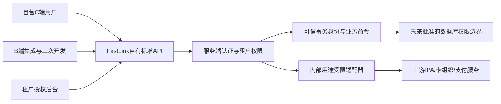

# 产品边界追加纠正

依据sources/02-CORRECTION-AND-RESUME.md及03-GATE1-APPROVAL.md，此纠正替代此前任何“向B端提供第三方IPA接口”的解释或表述。原始工单文字保留在00文件，不回写历史；旧表述不得再作为接口或权限设计依据。

1. 自营C端是普通FastLink自营Tenant，不能用NULL/global或平台旁路。
2. B端OEM/ODM使用FastLink统一标准自有API及授权式管理后台，供直接使用、集成和二次开发。
3. 上游IPA、卡组织、支付服务只能通过FastLink内部适配器接入。不得向B端透传上游接口、认证身份、秘密、Secret引用或原始配置。
4. 租户后台只配置获准品牌、人员、预定义可分配角色和业务功能，不得越权或直接修改账本。
5. 租户API Client必须绑定tenant/environment和限定Scope，强制幂等、审计，不得自提权。调用者只能在获准业务入口使用其Scope，不自动获得所有USER/TENANT_ADMIN权限。

图仅表示正式产品边界，数据库/适配器集成并未在本工单实现。B端不能绕过FastLink调用上游。内部adapter也不是全租户通权：单tenant/environment/provider/purpose、最小配置、幂等、审计、受批准状态机约束。

客户可见的provider/status/capabilities/rollout仅是脱敏业务摘要；现有能力枚举出现PIN/CVV读取能力，不代表对外披露许可（DB7-C06）。不得以提供白标二次开发为由返回原始provider响应。
